# BIRCH

## Introduction

BIRCH(Balanced Iterative Reducing and Clustering using Hierarchies), proposed by Zhang et al., is an incremental clustering algorithm, which mainly targets at large-scale data sets, has fast running speed, can effectively deal with noise. The algorithm complexity can reach $O(N)$.

## Features

- Each cluster contains a triple tuple: $CF = (N, LS, SS)$. Where, $N$ is the sample size in the cluster; $LS$ is a vector, representing the linear sum of points in each dimension within the cluster ($\sum ^N_{i=1} \vec X $); $SS$ is a scalar, representing the sum of squares of all sample points in the cluster( $\sum^N_{i=1} \vec X^2$) 

- CF tree is a highly balanced tree, containing three parameters: the maximum CF number of leaf nodes $L$(leaf), the maximum CF number of internal node (non-leaf node) $B$(branch), and the cluster radius threshold $T$(threshold).

## Algorithm Flow

1. Construct a CF tree
2. (optional) Build a smaller tree(cut off outlier nodes, combining similar nodes etc.)
3. Global Clustering(use K-Means to cluster the leaf nodes)
4. (optional) Cluster Refining(relabel the points based on previous clustering centroids)

## Example

1. Let $B=L=3$, $T=0.1$: Insert the first point, construct a new node. 

   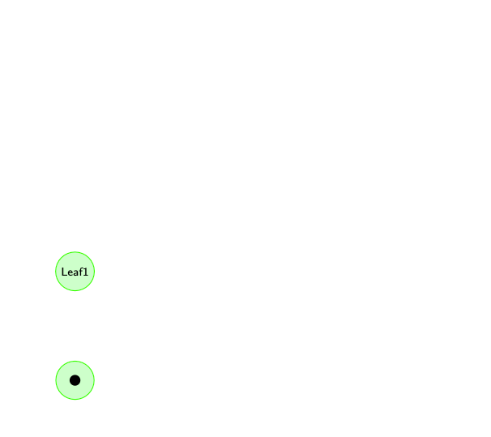

2. Add in a new point, according to $T$ and the distance between the node and the new point, judge whether could be added in the same node(here the answer is yes).

3. Repeat 2, construct a new node and a root node to connect the 2 nodes together.

   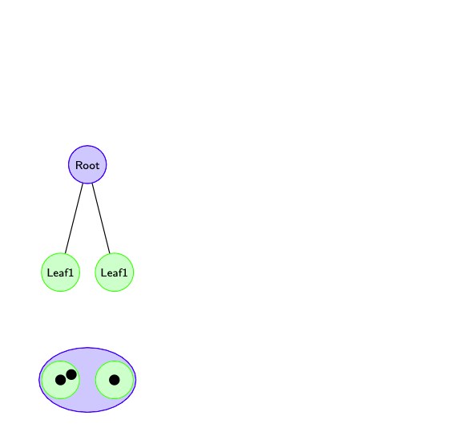

4. Keep repeating step 2(3). 

   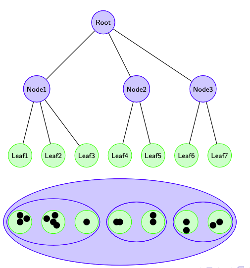

5. Add in a new point. The pink Node1 contains 4 leaves, which is larger than $L$.  

   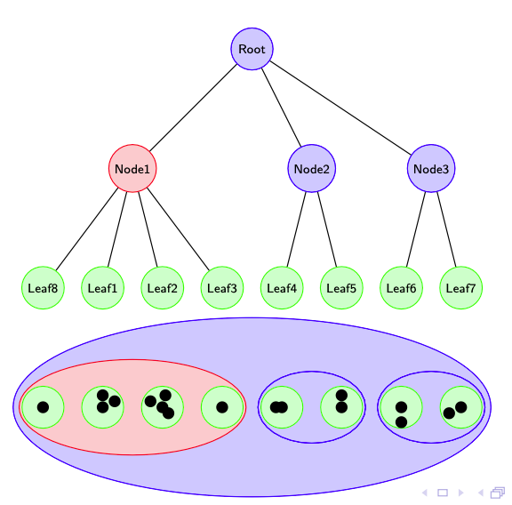

6. Split Node1 into Node1' and Node1'' according to the distances between the clusters(nodes). The Root node contains 4 internal nodes, which is larger than $B$. 

   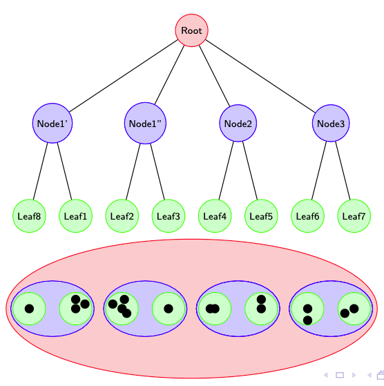

7. Split Root node into Node0' and Node0'', and increase the tree height(construct a new root node).

   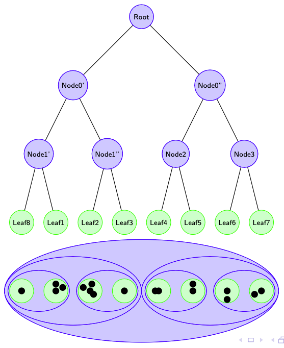

## Codes in R

```{r}
library(dplyr)
BIRCH<-function(dataset, B, L, Thre, dist){
  dataset<-as.data.frame(dataset)
  CFtree<<-list()
  for(i in 1:nrow(dataset)){
    Generate_CFtree(newpoint=dataset[i,]%>%as.numeric(), B, L, Thre, i, dist)
    print(i)
  }
}
#=============MAIN FUNCTION==============
Generate_CFtree<-function(newpoint, B=3, L=3, Thre=0.3, i, dist){
  depth<-length(CFtree)
  if(depth==0){ #when tree is empty, build a 2 layer CF tree directly
    Generate_nullnode(newpoint, 0, 1, 1, 1)
  }
  else{
    index<-Find_nearCF(newpoint, depth, CI=CFtree[[depth]][[1]]$CI)
    depth<-2
    cf_leaf<-CFtree[[1]][[index]]
    PN<-cf_leaf$PI
    cf0<-CFtree[[2]][[PN]]
    #whether within the radius of T
    if(distance(newpoint, CFtree[[1]][[index]]$LS/CFtree[[1]][[index]]$N)<=Thre){
      #update the new added leaf node
      CFtree[[1]][[index]]<<-list(N=cf_leaf$N+1, LS=cf_leaf$LS+newpoint, SS=cf_leaf$SS+sum(newpoint^2),
                                PI=cf_leaf$PI, CI=append(cf_leaf$CI,i), index=cf_leaf$index)
    }
    else{ #without the radius, create the new leaf node CF and update root node
      cf_new<-Generate_nullnode(newpoint, 1, i, PN, NULL)
      #update root node, triple group already updated in 'Find_nearCF'
      CFtree[[2]][[PN]]$CI<<-append(cf0$CI, cf_new$index)
      #whether need to split node
      Split_node(B, L, 1, CI=CFtree[[2]][[PN]]$CI, i, dist)
      }
    }
  }
#=======CREATE NEW NODE======
Generate_nullnode<-function(newpoint, depth=1, i, PI=0, CI){
  if(depth==0){ #empty tree
    temp<-list(N=1, LS=newpoint, SS=sum(newpoint^2), PI=1, CI=1, index=1)
    CFtree[[paste0('height_',depth+1)]]<<-list(temp)
    temp<-list(N=1, LS=newpoint, SS=sum(newpoint^2), PI=0, CI=1, index=1)
    CFtree[[paste0('height_',depth+2)]]<<-list(temp)
  }
  else if(depth==1){ #if leaf node, requires PI
    temp<-list(N=1, LS=newpoint, SS=sum(newpoint^2), PI=PI, CI=i, index=length(CFtree[[1]])+1)
    CFtree[[paste0('height_',depth)]][[temp$index]]<<-temp
  }
  else{ #not leaf node, requires PI, CI
    if(is.null(CFtree[[paste0('height_',depth)]])==T){#create root node
      temp<-list(N=i, LS=newpoint, SS=Extract(depth-1, 1)$SS%>%unlist%>%as.numeric(), PI=PI, CI=CI, index=1)
      CFtree[[paste0('height_',depth)]]<<-list(temp)
    }
    else{#create split node, N is the sample size of every CI
      #a<-sapply(Extract(depth-1, CI)$CI,'[',i = 1:max(sapply(Extract(depth-1, CI)$CI, length)))%>%t()%>%as.data.frame()%>%is.na()
      temp<-list(N=Extract(depth-1, CI)$N%>%as.data.frame()%>%sum(), LS=newpoint, SS=sapply(Extract(depth-1, CI)$SS,'[',i = 1)%>%unlist%>%sum(), PI=PI, CI=CI, index=length(CFtree[[depth]])+1)
      CFtree[[paste0('height_',depth)]][[temp$index]]<<-temp
    }
  }
}
#============DISTANCE FUNCTION==========
distance=function(point_1, point_2){
  return(sqrt(sum((point_1-point_2)^2)))
}
distance_CF = function(CF_1, CF_2, dist='intercluster' ){
  if (dist == 'Euclidean'){
    temp = distance(CF_1$LS/CF_1$N, CF_2$LS/CF_2$N)
  }
  else if (dist == 'Manhattan'){
    temp = abs(CF_1$LS/CF_1$N-CF_2$LS/CF_2$N)
  }
  else if (dist == 'intercluster'){
    temp = sqrt(CF_1$SS/CF_1$N-2*sum(CF_1$LS*CF_2$LS)/(CF_1$N*CF_2$N)+CF_2$SS/CF_2$N)
  }
  else{
    stop('The distance method doesn\'t exist.')
  }
  return(temp)
}
#=======AMONG NODE where DEPTH=depth-1, FIND NEAREST NODE to 'newpoint'===
#=======UPDATE ROOT NODE AFTER INSERT=====================================
Find_nearCF<-function(newpoint, depth, CI){
  PN<-CFtree[[depth-1]][[CI[1]]]$PI
  cf0<-CFtree[[depth]][[PN]]
  CFtree[[depth]][[PN]]<<-list(N=cf0$N+1, LS=cf0$LS+newpoint, 
                               SS=cf0$SS+sum(newpoint^2),
                               PI=cf0$PI, CI=cf0$CI, index=cf0$index)
  mindist<-Inf
  for(cf in CFtree[[depth-1]][CI]){
    temp<-distance(newpoint, cf$LS/cf$N)
    if(temp<mindist){
      mindist<-temp
      near<-cf$index
      CN<-cf$CI
    }
  }
  if(depth==2)
    return(near)
  else
    return(Find_nearCF(newpoint, depth-1, CN))
}
#===========SPLIT NODE===========
Split_node<-function(B, L, depth, CI, i, dist){
  BL<-ifelse(depth==1, L, B)
  if(length(CI)>BL){
    PPI<-Find_farCF(depth, CI, i, dist)
    depth<-depth+1
    if(depth<length(CFtree))
      return(Split_node(B, L, depth, CI=CFtree[[depth+1]][[PPI]]$CI, i, dist))
  }
  return(1)
}

#===========FIND FARTHEST 2 CF============
Find_farCF<-function(depth, CI=1:length(CFtree[[1]]), i, dist){
  #compute distance of every 2 CF
  comb<-combn(CI,2)
  maxdist<--Inf
  for(k in 1:ncol(comb)){
    temp<-distance_CF(CFtree[[depth]][[comb[1,k]]], CFtree[[depth]][[comb[2,k]]], dist)
    if(temp>maxdist){
      maxdist<-temp
      far<-comb[,k]
    }
  }
  #find where CF belong except the farthest 2
  which_cf<-c()
  for(cf in CFtree[[depth]][CI[!CI%in%far]]){
    temp<-c(distance_CF(cf, CFtree[[depth]][[far[1]]], dist), distance_CF(cf, CFtree[[depth]][[far[2]]], dist))%>%which.min()
    which_cf<-c(which_cf,temp)
  }
  #judge whether need to increase the layer of the tree, build 2 root nodes and reallocate the child nodes
  tag<-0
  if(length(CFtree[[depth+1]])==1){#if the number of nodes that needs to split is 1
                                  #then need to increase the layer
    Generate_nullnode(CFtree[[depth+1]][[1]]$LS, depth+2, i, PI=0, CI=1:2)
    tag<-1
  }
  PN<-CFtree[[depth]][[CI[1]]]$PI
  CN<-c(far[1],CI[!CI%in%far][which(which_cf==1)])
  PPI<-ifelse(tag==1, 1, CFtree[[depth+1]][[PN]]$PI)
  #build the first node
  cf_new<-Generate_nullnode(newpoint=apply(Extract(depth, CN)[,2]%>%as.data.frame,1,sum), depth+1, i, PI=PPI, CI=CN)
  CN1<-CI[!CI%in%CN]
  ls<-apply(Extract(depth, CN1)[,2]%>%as.data.frame,1,sum)
  #build the second node
  CFtree[[depth+1]][[PN]]<<-list(N=Extract(depth, CN1)$N%>%as.data.frame()%>%sum, LS=ls, SS=Extract(depth, CN1)[,3]%>%as.data.frame%>%sum, PI=PPI, CI=CN1, index=PN)
  #if tree layer doesn't increase, then need to update the CI of the root node
  if(tag==0)
    CFtree[[depth+2]][[PPI]]$CI<<-append(CFtree[[depth+2]][[PPI]]$CI, cf_new$index)
  #update the parent node of the child node
  for(j in 1:length(CI)){
    CFtree[[depth]][[CI[j]]]$PI<<-ifelse(CI[j]%in%CN, cf_new$index, PN)
  }
  return(PPI)
}

Extract<-function(depth, CI=1:length(CFtree[[depth]])){
  CFdf<-as.data.frame(t(sapply(CFtree[[depth]][CI], "[", i = 1:max(sapply(CFtree[[1]], length)))))
  return(CFdf)
}
```

## Visualization

- Sensitive to $T$ Parameter

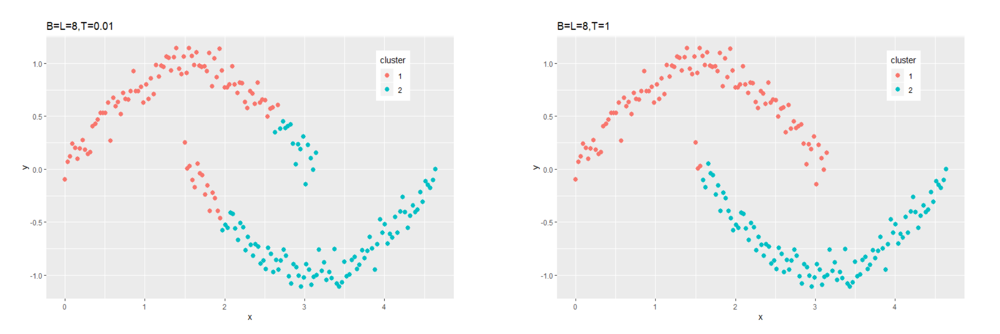

- Show ineffective results when facing with nonspherical clusters

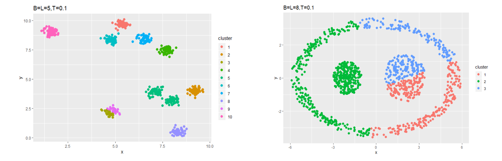

# ROCK

## Introduction

ROCK(RObust Clustering using linKs) , proposed by Guha et al. is used to classify discrete and Boolean type data, mianly based on calculating "Goodness" function to quantify the connectivity between point sets.

## Algorithm Flow

1. Sampling
2. ROCK clustering
3. Label data

## Definition

- Sampling size: $s\ge fN+\frac{N}{|u|}\log(\frac{1}{\delta})+\frac{N}{|u|}\sqrt{\log(\frac{1}{\delta})^2+2f|u|\log(\frac{1}{\delta})}$, where $|u|$ represents the cluster point numbers, $f$, $\delta$ are decimals between $0$ and $1$, $N$ means data set size.
- Similarity Function: $sim(p_i, p_j)= \frac{|p_i\bigcap p_j|}{|p_i\bigcup p_j|}$, where $|p_i|$ means the items within $p_i$

- Neighbor: if $sim(p_i, p_j)\ge\theta$, where $0\le\theta\le1$
- Link Function: Number of the common Neighbors between $p_i$, $p_j$
- Goodness Function: $g(C_i,C_j)=\frac{\text{link}(C_i,C_j)}{(n_i+n_j)^{1+2f(\theta)}-n_i^{1+2f(\theta)}-n_j^{1+2f(\theta)}}$, where $C_i$ means clusters, $n_i$ means sample size within $C_i$, $f(\theta)=\frac{1-\theta}{1+\theta}$ 

## Innovation

Revise the Similarity Function into Euclidean Distance Function, and the Link Function into $sim(p_i, p_j)\le\theta$, which makes it applicable into continuous data sets.

## Codes in R

```{r}
rm(list=ls())
library(dplyr)
#===========phase1 SAMPLE============
sampleROCK<-function(dataset,f,delta,umin){
  N<-nrow(dataset)
  #minimum sample size
  s<-min(ceiling(f*N+N/umin*log(1/delta)+N/umin*sqrt((log(1/delta))^2+2*f*umin*log(1/delta))),N)
  #sampling the serial number
  sample_id<<-sample(1:N,s,replace = F)
  left_id<<-setdiff(1:N,sample_id)
  dat<-dataset[sample_id,]
  #if no difference in sample size before and after sampling，
  #then return original sample(or not consistent on labeling)
  if(nrow(dat)==nrow(dataset)){
    warning('equal sample size as original data, return with original data')
    return(dataset)
  }
  else return(dat)
}
#=============phase2 ROCK CLUSTERING=============
avesamp<-function(samp){
  n <- nrow(samp)
  comb<-combn(n,2,simplify=T)
  averdis <- 0
  for(i in 1:ncol(comb)){
    averdis <- averdis + sqrt(sum(samp[comb[1,i],]-samp[comb[2,i],])^2)
  }
  averdis <<- averdis/(ncol(comb))
}


Similarity<-function(p1, p2, funct='Jaccard'){
  if(funct=='Jaccard'){
    s1<-sum(p1|p2)
    if(s1==0) s1<-1
    return(sum(p1&p2)/s1)
  }
  if(funct=='cosine'){
    return(sum(p1*p2)/sqrt(sum(p1^2)*sum(p2^2)))
  }
  if(funct=='L2'){
    return(sqrt(sum((p1-p2)^2))/averdis)
  }
}

Goodness<-function(theta, n1, n2, link){
  return(link/((n1+n2)^(1+2*f(theta))-n1^(1+2*f(theta))-n2^(1+2*f(theta))))
}

f<-function(theta){
  return((1-theta)/(1+theta))
}

Compute_link<-function(dataset, theta, funct, type){
  n<-nrow(dataset)
  link<-nbr<-matrix(rep(0,n*n), nrow=n)
  for(i in 1:(n-1))
    for(j in (i+1):n)
      nbr[j,i]<-nbr[i,j]<-Similarity(dataset[i,],dataset[j,],funct)
  nbr[type==1]<-nbr<=theta
  nbr[type!=1]<-nbr>=theta
  #nbr%*%nbr, diagnal=0
  for(i in 1:n){
    if(which(nbr[i,]==T)%>%length>1){
    comb<-combn(which(nbr[i,]==T),2)
      for(j in 1:ncol(comb)){
        link[comb[1,j],comb[2,j]]<-link[comb[1,j],comb[2,j]]+1
        link[comb[2,j],comb[1,j]]<-link[comb[2,j],comb[1,j]]+1
      }
    }
  }
  return(link)
}

#============MAIN FUNCTION=============
Build_localheap<-function(dataset, link, theta){
  localheap<-list()
  for(i in 1:nrow(dataset)){
    goodness<-data.frame(goodness=NA, j=NA)
    count<-1
    for(j in which(link[i,]!=0)){
      goodness[count,1]<-Goodness(theta, 1, 1, link[i,j])
      goodness[count,2]<-j
      count<-count+1
    }
    localheap[[i]]<-list(gninf=goodness, index=i)
  }
  return(localheap)
}

Build_globalheap<-function(localheap){
  globalheap<-data.frame(max_goodness=NA, max_i=NA, max_j=NA)
  count<-1
  for(i in 1:length(localheap)){
    c_i<-localheap[[i]]
    if(is.na(c_i$gninf[1,1])) next
    else{
      globalheap[count,]<-c(c_i$gninf[,1]%>%max,
                            i,
                            c_i$gninf[,2][c_i$gninf[,1]%>%which.max])
      count<-count+1
    }
  }
  return(globalheap)
}


ROCK<-function(dataset, theta, k, funct, type){
  if(funct=='L2') avesamp(dataset)
  link<-Compute_link(dataset, theta,funct,type)
  localheap<-Build_localheap(dataset, link, theta)
  globalheap<-Build_globalheap(localheap)
  while(nrow(globalheap)>k){
    u<-globalheap[which.max(globalheap$max_goodness),3]
    v<-globalheap[which.max(globalheap$max_goodness),2]
    globalheap<-globalheap[-which(globalheap[,2]==u|globalheap[,2]==v),]
    w<-length(localheap)+1
    localheap[[w]]<-list(gninf=data.frame(goodness=NA, j=NA), index=c(localheap[[u]]$index, localheap[[v]]$index)%>%sort)
    inter<-c(localheap[[u]]$gninf[,2],localheap[[v]]$gninf[,2])%>%base::unique()
    inter<-inter[-which(inter==v|inter==u)]
    link<-link%>%cbind(rep(0,nrow(link)))%>%rbind(rep(0,ncol(link)+1))
    if(length(inter)!=0){
      for(x in inter){
        link[w,x]<-link[x,w]<-link[x,u]+link[x,v]#no need to judge x,u(write into symmetric matrix)
        #delete u,v in 'localheap[[x]]'
        localheap[[x]]$gninf<-localheap[[x]]$gninf[-which(localheap[[x]]$gninf[,2]==u|localheap[[x]]$gninf[,2]==v),]
        gn_wx<-Goodness(theta,length(localheap[[w]]$index),length(localheap[[x]]$index),link[w,x])
        #update 'localheap[[x]]' and add 'localheap[[w]]'
        localheap[[x]]$gninf<-rbind(localheap[[x]]$gninf,c(gn_wx,w))
        localheap[[w]]$gninf<-rbind(localheap[[w]]$gninf,c(gn_wx,x))
        #update the max goodness in 'globalheap' (might change)
        c_x<-localheap[[x]]
        globalheap[which(globalheap$max_i==x),]<-c(c_x$gninf[,1]%>%max, x,
                            c_x$gninf[,2][c_x$gninf[,1]%>%which.max])
      }
    localheap[[w]]$gninf<-localheap[[w]]$gninf[-1,]
    }
    globalheap<-rbind(globalheap, c(localheap[[w]]$gninf[,1]%>%max, w,
                                    localheap[[w]]$gninf[,2][localheap[[w]]$gninf[,1]%>%which.max]))
    localheap[[u]]<-w
    localheap[[v]]<-w
    print(nrow(globalheap))
  }
  globalheap<<-globalheap;localheap<<-localheap
  link<<-link
  return(1)
}

#===============phase3 LABEL DATA============
label<-function(dataset,u,newpoint,theta,k,funct,type){
  criteria<-c()
  for(i in 1:length(u)){
    d<-dataset[clu[which(clu[,2]==i),][,1],]
    sim<-c()
    for(j in 1:nrow(d)) sim<-c(sim,Similarity(newpoint,d[j,],funct = funct))
    ni<-ifelse(type==1,sum((sim<=theta)+0),sum((sim>=theta)+0))
    criteria<-c(criteria,ni/(1+nrow(d))^f(theta))
  }
  clu[nrow(clu)+1,]<<-c(index=left_id[k],cluster=which.max(criteria))
}
#main function

LableonDisk<-function(dataset,samp,theta,funct,type){
  u<-globalheap$max_i
  sequ<-seq(1,length(u),1)
  index_sample<-c()
  cl<-c()
  for(i in 1:length(u)){
    l<-localheap[[u[i]]]$index
    index_sample<-c(index_sample,l)
    cl<-c(cl,rep(sequ[i],length(l)))
  }
  #resort the serial no and the belonging cluster after sampling
  clu<<-data.frame(index=index_sample,cluster=cl)  
  if(nrow(dataset)==nrow(samp)) return(clu)
  clu$index<<-sample_id[clu$index]
  if(length(left_id)!=1)  for(k in 1:length(left_id)) {
    label(dataset,u,dataset[left_id,][k,],theta,k,funct,type)
    print(k)
  }
  else  label(dataset,u,dataset[left_id,],theta,1,funct)
  return(clu)
}
```

## Visualization

- Not sensitive to $\theta$ parameter

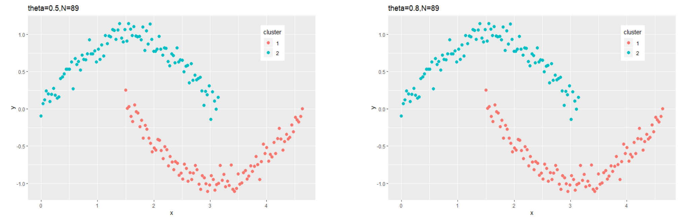

- Perform well for continuous data

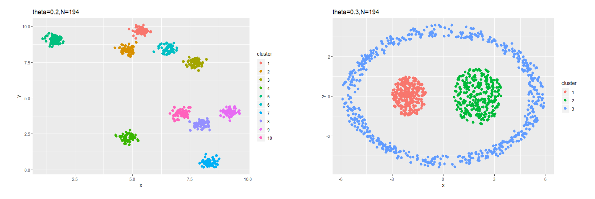

- Perform well on simulated descrete data set

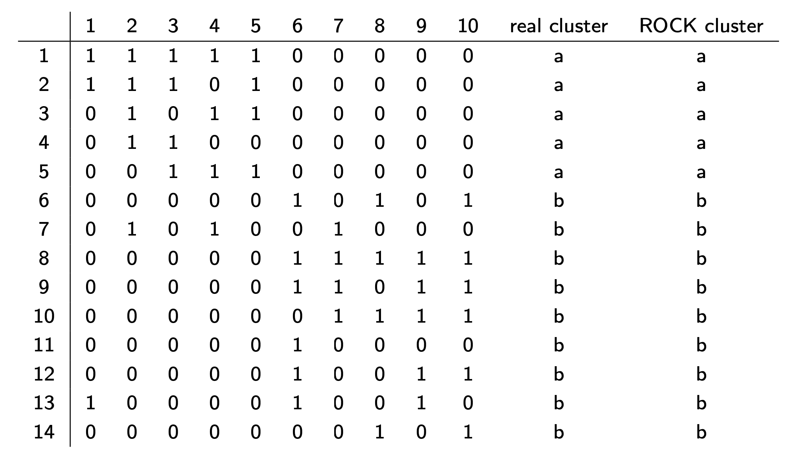


